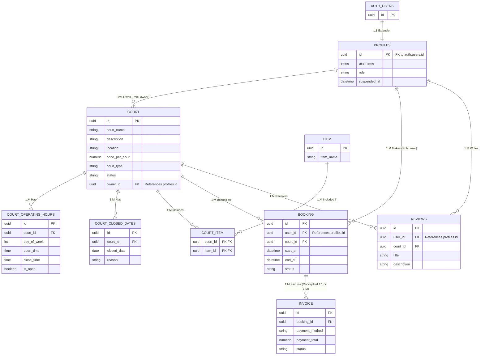

# Pickle All - Entity Relationship Diagram (ERD)

This document outlines the Entity Relationship Diagram (ERD) for the Pickle All database schema, mapping out the connections between our entities.

## Mermaid ER Diagram

## Entity Relationships Explained

### One-to-One (1:1)
- **`auth.users` ↔ `profiles`**: Every Supabase auth user has exactly one corresponding profile. The `id` in the `profiles` table acts as both the Primary Key and a Foreign Key linking directly to `auth.users.id`.

### One-to-Many (1:M)
- **`profiles` (Owner) ↔ `court`**: A single business owner can own multiple courts, but each court is owned by only one owner (via `owner_id`).
- **`court` ↔ `court_operating_hours`**: A single court can have multiple operating hour records (one for each day of the week).
- **`court` ↔ `court_closed_dates`**: A single court can have multiple specific closed dates (e.g., holidays, maintenance).
- **`profiles` (User) ↔ `booking`**: A customer can make many bookings over time.
- **`court` ↔ `booking`**: A court will have many bookings linked to it.
- **`booking` ↔ `invoice`**: A booking can have an invoice (or potentially multiple invoices if partial payments or refunds are handled on separate records).
- **`profiles` (User) ↔ `reviews`**: A user can write many reviews across different courts.
- **`court` ↔ `reviews`**: A court can receive many reviews from different users.

### Many-to-Many (M:N)
- **`court` ↔ `item`**: A court can have multiple items/amenities (e.g., Paddles, Balls), and a specific item type can belong to multiple courts.
  - This is resolved via the junction table **`court_item`**.
  - **`court` ↔ `court_item`** is One-to-Many.
  - **`item` ↔ `court_item`** is One-to-Many.
